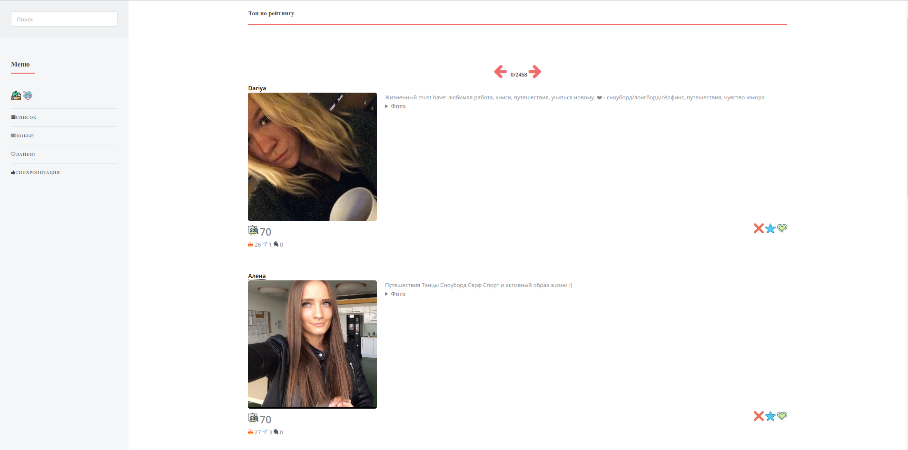

# Tinder crawler: recommendation scoring

I inspired to create this project after thinking about best strategy of use tinder's free superlike per day. 

I also found similar math problem - [Secretary problem](https://en.wikipedia.org/wiki/Secretary_problem)

**But my strategy is write my own tinder client :)**

This project allow to sort your tinder recomendations based on [simple keyword scoring model](/src/main/java/ru/gotinder/crawler/scoring/ScoringModelService.java)

You will no longer see recomendations with empty description!

Screenshot

 

### How it works: 

1. Pull tinder recomendations (+ store in [postgresql database](/sql/schema.sql))

2. Apply scoring model

3. Show results via web gui (top by rating,latest data,search,possible likes)

4. You can like/pass/superlike from gui and sync your verdicts with tinder backend.

### Dependencies
[my fork of java tinder-api](https://github.com/mark-dev/tinder-api)

### TODO

Page with random recomendations (maybe rating lies?) 